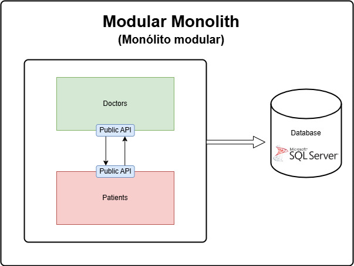

# health-and-med

API Web ASP.NET Core da Health&Med, desenvolvida para o Hackathon da FIAP Pós Tech.

## arquitetura do projeto

Este projeto foi desenvolvido com base na arquitetura de **monólito modular**. Cada módulo de um monólito modular (neste projeto, _"Doctors"_ e _"Patients"_) é, conceitualmente, um microsserviço. No entanto, essa abordagem permite que os microsserviços sejam mantidos dentro da mesma unidade de _deploy_.

Ou seja, na plataforma .NET, ambos os microsserviços estão na mesma _Solution_, mas continuam **segregados**, pois um módulo **não acessa diretamente as funcionalidades do outro**.

### comunicação entre módulos

Dentro de uma arquitetura de monólito modular, os módulos (_microsserviços_) se comunicam da mesma forma que em uma arquitetura tradicional de microsserviços. Entretanto, essa comunicação **não acontece via requisições HTTP**, mas sim por meio de **mensageria**.

Cada módulo expõe uma série de contratos que podem ser consumidos por meio de eventos ou _message queues_, permitindo a troca de informações sem que um módulo precise acessar diretamente as funcionalidades internas do outro.

### persistência de dados

Outra vantagem dos monólitos modulares é a gestão da persistência de dados. Diferente de uma arquitetura de microsserviços, onde cada serviço geralmente possui seu próprio banco de dados, no monólito modular, **os módulos podem compartilhar o mesmo banco**.

Para evitar que os dados de um módulo se misturem com os de outro, utilizamos _schemas_ distintos. No caso desta aplicação:
- O módulo _"Doctors"_ utiliza o _schema_ **doctors**.
- O módulo _"Patients"_ utiliza o schema **patients**.

Essa abordagem garante isolamento **lógico dos dados**, mantendo a organização e evitando acoplamentos indesejados entre os módulos.
